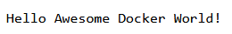

# Hello Docker World

A simple web application written in Go that displays a "Hello Awesome Docker World!" meesage.

Used mostly for demonstration in various courses and presentations.

It can be used in containers or by following the classical approach.

Contains the following set of files:

```text
.
├── app                       ---> application files
|   ├── go.mod                ---> module definition
|   └── main.go               ---> main application file
├── Dockerfile                ---> used to build the app image
└── README.md                 ---> this file
```

Image can be build with the following command:

```bash
# Build the application image
docker image build -t app3 .
```

Container can be run with the following command:

```bash
# Run the application
docker container run -d --name app3 -p 5000:5000 app3
```

When built and deployed correctly, the result should look like this:



Should you want to substitute the word ***Awesome*** with something else, for example ***Beautifull***, you must execute:

```bash
# Run the application
docker container run -d --name app3 -e HELLO="Beautifull" -p 5000:5000 app3
```
